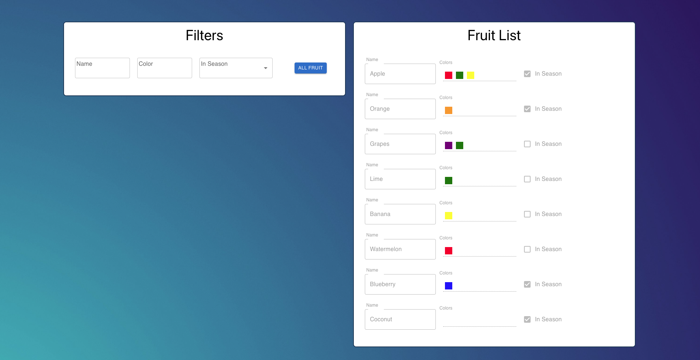

## Description:
React app to filter and display Fruit list. Fruit item contains name, colors, and in season fields. 
 
 

## Available Scripts

In the project directory, you can run:

### `npm start`

Runs the app in the development mode.\
Open [http://localhost:3000](http://localhost:3000) to view it in the browser.

## Design
App uses Container/Component design. 

Components: 
Container is used to manage and process data. 
Component contains only html (like) elements. 

Http: 
Saga: Handles async calls to backend 
Reducer: Contains app's store 
Selector: Data is accessed via selectors 

