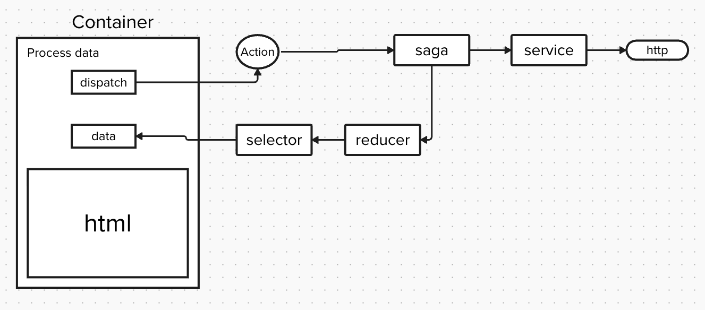

## Description:
React app to filter and display Fruit list. Fruit item contains name, colors, and in season fields.

## Available Scripts

In the project directory, you can run:

### `npm start`

Runs the app in the development mode.\
Open [http://localhost:3000](http://localhost:3000) to view it in the browser.

## Design
App uses Container/Component design.

Components:
Container is used to manage and process data.
Component contains only html (like) elements.

Http:
Saga: Handles async calls to backend
Reducer: Contains app's store
Selector: Data is accessed via selectors

